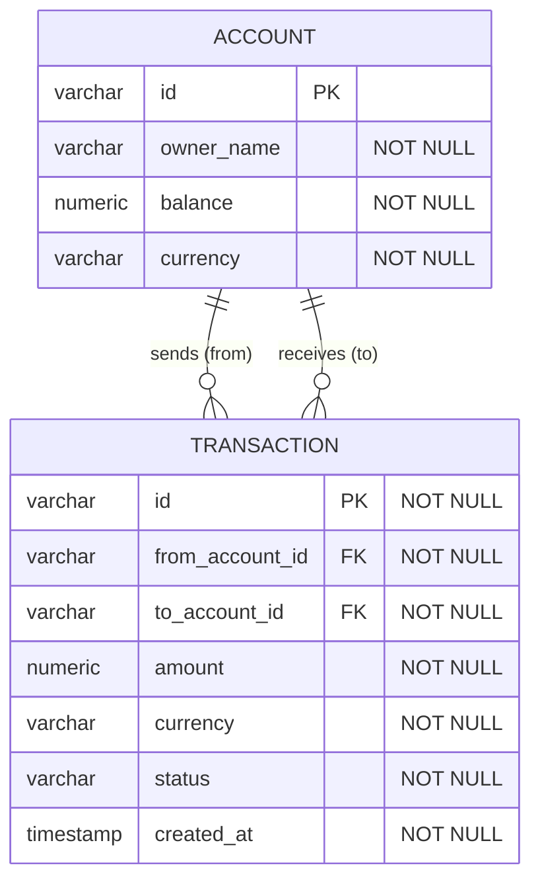

<!-- schema.md -->

## EER diagram design choices (API → tables)

**Entity naming**
- Singular: `ACCOUNT`, not `ACCOUNTS`
- Uppercase in Mermaid = convention only
- Lowercase `snake_case` in SQL (`bank_account`) — mismatch is fine, they serve different purposes

**Primary key type**
- Chose `varchar` over `int`
- **Why:** data may come from multiple source systems with different ID formats
- **Benefit:** avoids ID collisions when merging, avoids future type migration
- **Trade-off:** heavier storage, slower joins at scale — only worth it if multiple sources are real

**Column required - NOT NULL**
- Columns that are defined as required in the specification should be set to `NOT NULL`
**Column types**
- Money → `numeric`, never `float` (floats cause rounding errors)
- Text → `varchar(n)` enforces a length limit; `text` doesn't (validation becomes the app's job)

**Relationships**
- Written on their own line, separate from entity blocks
- Cardinality symbols: `||` = exactly one, `o{` = zero or many
- Foreign key (`account_id FK`) goes on the "many" side

**Underlying principle**
- Every choice is tied to something concrete: expected data sources, financial precision, query patterns — not default habit

  
## Symbol	Betydelse
|o	noll eller en
||	exakt en
}o	noll eller många
}|	en eller många

